# Project Context & Architecture

> **Master Entry Point for AI Agents**
> *Read this file first to understand the system map.*

## System Overview
The **Avalanche Archiver** is a Node.js-based system that:
1.  **Scrapes** daily avalanche bulletins, weather reports, and incidents from public sources (Bayern, Tirol, Vorarlberg).
2.  **Archives** these assets (PDFs, JSON, Images) permanently.
3.  **Builds** a static HTML website to browse this historical data.
4.  **Visualize**: Uses **MapLibre GL JS** for all interactive maps (Planning, Incidents, Snow Depth). Leaflet is deprecated and not used.

## System Map (Mermaid)

```mermaid
graph TD
    subgraph Sources
        LWD[Lawinenwarndienst]
        LAWIS[Lawis.at]
        WETTER[Weather Reports]
        STATIONS[Station Data]
        GEO[Geosphere Austria]
    end

    subgraph "Engine (tools/)"
        DAILY[fetch_daily.js]
        INC[fetch_lawis_incidents.js]
        W_TEXT[fetch_weather_report.js]
        W_STAT[fetch_weather.js]
        W_GEO[fetch_geosphere.js]
        ENRICH[enrich_profiles.js]
        BUILD[build.js]
        UPL[fetch_uploads.js]
    end

    subgraph "Data Storage (data/)"
        PDFs[PDFs]
        JSON[JSON Metadata]
        IMG[Images]
    end

    subgraph "Output (archive/)"
        A_REGIONS[Regional Archives]
        A_INC[Incidents]
        A_WET[Weather]
        A_PROF[Profiles]
        A_GPX[GPX Library]
    end

    LWD --> DAILY
    LAWIS --> INC
    WETTER --> W_TEXT
    STATIONS --> W_STAT
    GEO --> W_GEO

    DAILY --> PDFs
    DAILY --> JSON
    INC --> JSON
    INC --> IMG
    
    W_TEXT --> JSON
    W_STAT --> JSON
    W_GEO --> JSON
    UPL --> JSON
    GPX --> JSON
    
    JSON --> ENRICH
    ENRICH --> JSON

    daily_job --> DAILY
    daily_job --> INC
    daily_job --> W_TEXT
    daily_job --> W_STAT
    daily_job --> W_GEO
    daily_job --> ENRICH
    daily_job --> UPL
    daily_job --> GPX

    BUILD --> PDFs
    BUILD --> JSON
    BUILD --> IMG

    BUILD --> A_REGIONS
    BUILD --> A_INC
    BUILD --> A_WET
    BUILD --> A_PROF
```

## Documentation Index

### 📂 Archive Output (`archive/`)
*The user-facing website.*
- [Root Context](archive/CONTEXT.md)
- **Regions**:
    - [Allgäu Alps Central](archive/allgau-alps-central/CONTEXT.md)
    - [Allgäu Alps East](archive/allgau-alps-east/CONTEXT.md)
    - [Allgäu Alps West](archive/allgau-alps-west/CONTEXT.md)
    - [Allgäu Prealps](archive/allgau-prealps/CONTEXT.md)
- **Features**:
    - [Incidents](archive/incidents/CONTEXT.md) - Accident reports & analysis.
    - [Weather](archive/weather/CONTEXT.md) - Mountain station data.
    - [Profiles](archive/profiles/CONTEXT.md) - Snowpack analysis.
    - [Snow Depth](archive/snow-depth/CONTEXT.md) - 3D Map.
    - [Ground & Webcams](archive/ground-conditions/CONTEXT.md) - User uploads.
    - **System**:
        - `health.json` - Build status and diagnostics.
        - `_headers` - Cloudflare caching rules.

### 💾 Data Storage (`data/`)
*Raw data from external sources.*
- [Data Context](data/CONTEXT.md) - Structure, retention policies, and data flow.

### 🗺️ Planning & Tools
*Interactive Modules.*
- [Planning Context](planning/CONTEXT.md)
- [GPX Library Context](gpx-library/CONTEXT.md) - Route Archive & Analysis.
- [Useful Info](useful-info/CONTEXT.md) - Curated external resources for ski touring.

### 🛠️ Tools & Logic (`tools/`)
*The scraping and build logic.*
- [Tools Context](tools/CONTEXT.md)
    - **Core Libraries**:
        - `tools/lib/config.js`: Central registry for URLs and paths.
        - `tools/lib/fetcher.js`: Robust HTTP client with retry logic.
        - `tools/lib/validateEnv.js`: Environment variable validation.
        - `tools/lib/translator.js`: Caching translation service (Google API).
    - **UI Source Files**:
        - **Shared Templates**: `tools/lib/templates.js` (Generates incidents, weather, profiles).
    - **Single Page Apps**:
        - [Snow Depth App](snow-depth/index.html)
        - [Planning App](planning/index.html)
        - [Profile Creator](profile-creator/index.html)

## Key Workflows
1.  **Daily Fetch**: `npm run fetch:all` (Orchestrates parallel fetches + profiles + enrichment).
2.  **Build Site**: `npm run build` (Generates `archive/` from `data/`).
3.  **Serve**: `npm run serve` (Local preview).

## 🧠 AI Resources
*Helper files specifically for AI agents.*
- **[Data Models](.ai/DATA_MODELS.md)**: Type definitions for `weather_stations.json`, `incidents.json`, etc.
- **Workflows**:
    - [Add New Region](.agent/workflows/add_region.md)
    - [Debug Scraper](.agent/workflows/debug_scraper.md)

